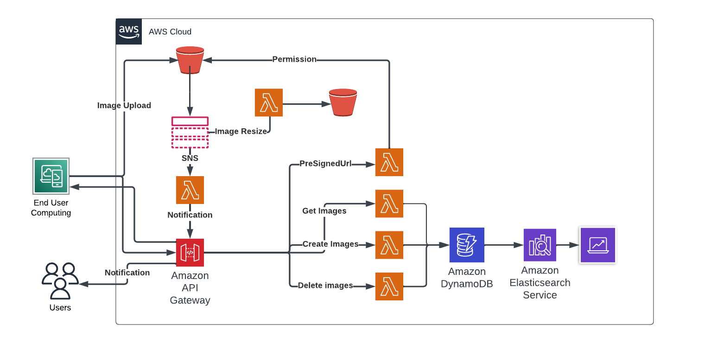

# Image optimization app using serverless framework

> This application is use to collect image from different users and optimized it to a specific size using serverless framework to aws



## Template features

### Project structure

The project code base is mainly located within the `src` folder. This folder is divided in:

- `functions` - containing code base and configuration for your lambda functions
- `libs` - containing shared code base between your lambdas

```
.
├── src
│   ├── lambda               # Lambda configuration and source code folder
│   │   ├── http
│   │   │   ├── getImages.js      # `GetAllImages` lambda source code
│   │   │   ├── createImages.js   # `CreateImages` lambda source code
│   │   │   ├── deleteImages.js   # `deleteImages` lambda source code
│   │   │   └── schema.ts         # `Hello` lambda input event JSON-Schema
│   │   │
│   │   └── index.ts            # Import/export of all lambda configurations
│   │
│   └── libs                    # Lambda shared code
│       └── apiGateway.ts       # API Gateway specific helpers
│       └── handlerResolver.ts  # Sharable library for resolving lambda handlers
│       └── lambda.ts           # Lambda middleware
│
├── package.json
└── serverless.yml              # Serverless service file
```
